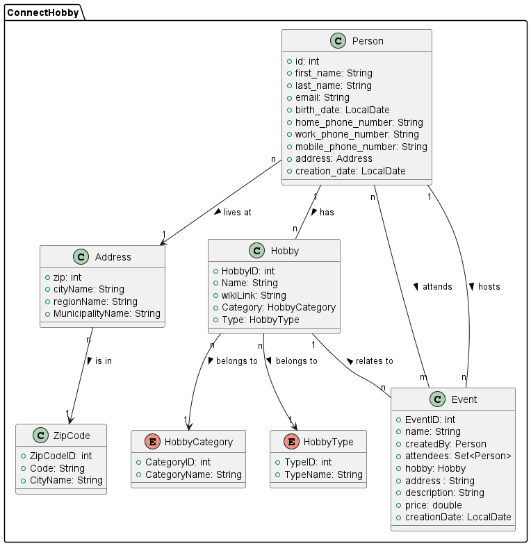
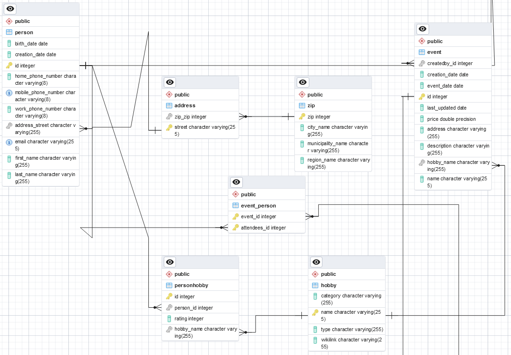

# Dat3-SP1

## Group
- Magnus
- Peter
- Sidsel
- Yusuf

## Business Idea
ConnectHobby er en platform, der forbinder folk baseret på deres hobbyer og interesser. Det giver brugerne mulighed for at oprette profiler, deltage i grupper og fællesskaber, deltage i begivenheder og finde ressourcer relateret til deres hobbyer. Platformen giver også virksomheder mulighed for at målrette mod et engageret publikum og promovere deres produkter og tjenester.

###Funktioner:

Profiloprettelse og Matchmaking: Brugere kan oprette detaljerede profiler, der nævner deres hobbyer, interesser, telefonnumre og adresser. ConnectHobby's smarte algoritmer foreslår derefter potentielle venner, grupper eller fællesskaber, de måske er interesserede i at deltage i, baseret på fælles interesser.
Brugeren kan også søge på hobbier og finde andre brugere, der deler deres interesser.

Begivenheds Hub: Platformen vil tilbyde en dedikeret sektion, hvor brugere kan opdage begivenheder relateret til deres hobbyer. Disse kunne variere fra lokale kunstklasser, fotografiture, boglæsningssessioner til massive virtuelle spilturneringer.

Begivenheds Registrering: Hver begivenhed kan have en detaljeret side, der nævner dens dagsorden, dato, sted (eller virtuelle platformdetaljer) og registreringsgebyr, hvis det er relevant. Brugere kan tilmelde sig og betale for disse begivenheder gennem platformen.

Begivenheds Hosting: Premium-brugere kan være vært for deres egne begivenheder, sætte kriterier for deltagerne og opkræve gebyrer.

###Monetarisering:

Begivenheds Gebyrer: ConnectHobby kan opkræve en provision for hver billet solgt til begivenheder, der er vært på dens platform.

Annoncekampagner: Indtægter kan genereres ved at opkræve virksomheder for at køre målrettede annoncekampagner.

Premium Abonnementer: Mens den grundlæggende platform kan være gratis, kan et premium abonnement tilbyde brugere yderligere fordele, såsom at være vært for deres egne begivenheder, få tidlig adgang til populære begivenheder eller en annoncefri oplevelse.

## Domain Model
Vi har lavet vores domænemodel i PlantUML, som kan ses i DomainModel.puml filen eller herunder:

## EER-Diagram
Vi har lavet vores EER diagram i pgAdmin, som kan ses herunder:

Det er helt utroligt grimt, vi vil gerne have noget guidance i hvordan vi kan gøre den pænere. Vores createscript kan ses i createscript-filen.

## Group Work

Vi startede projektet med at have et kort møde omkring arbejdsstrukturen, det her projekt er ikke særlig stort så det var vigtigt at have klare linjer for ikke at træde hinanden over tærerne.
Vi udviklede vore business case og fik den skåret ned til en størrelse som passede til projektet, vi har valgt ikke at tage nogle af vores ideer om monetarisering med i projektet og heller ikke bygge en algoritme til at connecte brugere med hinanden.
Vi lavede en domænemodel og fik feedback fra Jörg om at vi skulle tilføje events til den. Dette passede rigtig godt til vores business case, så det tilføjede vi.
I større projekter ville vi sætte et GitHub projects projekt op for at holde styr på det hele, men i dette projekt er det lidt overkill. I stedet satte vi vores userstories op som issues i GitHub så vi stadigvæk kunne holde styr på hvad der skulle laves.

Vi blev enige om strukturen for projektet og skrev en del noter til de finere detaljer m.h.t. cascading, directions og hvilke felter der skulle være unikke og hvilke felter der måtte være tomme.
Da fleste af vores tanker var sat op og alle var med på den aftalte struktur, da begyndte vi at inddele arbejdet: Halvdelen af os skulle opsætte entities og skrive relationerne op, samt at finde ud af hvilke attributter ville være passende. Den anden halvdel stod for at skrive unit tests.

Da entiteterne var sat op, gik vi i gang med at sikre at alle test virkede som de skulle og satte lidt flere tests op.
Vi arbejdede igennem i løbet af startdagen og stødte på flere problemer hen ad vejen; hovedsageligt med enums og datakonvertering på databasen.
Postgres gad ikke lade os skrive en custom-constraint check hvilket gav os flere errors. Vi endte med at bestemme os for at lave egen data, så vi ikke spilder tid på at løse noget relativt irrelevant.
Vi benyttede ikke så meget branching i dette projekt, hvilket gav nogle problemer når mere end en person arbejde på det samme. Det meste af tiden var vi i forskellige dele af koden, så det var ikke det store problem. Vi har generelt ret svært ved at bruge branches i gruppen, og det er en del vi gerne ville være bedre til. Vi er rigtig gode til at kommunikere med hinanden undervejs, så vi ikke har for mange merge conflicts.
Vi endte med at have alle vores tests i en klasse, hvilket ikke var særlig smart da det gjorde det svært at finde rundt i. Vi burde have lavet en testklasse for hver entity i stedet.

Alt i alt gik vores projekt godt, vi arbejdede effektivt og fik kommunikeret godt med hinanden undervejs. Det var nogle struktur-ting som kunne have været bedre, men vi er meget vandt til at arbejde sammen så det gik godt alligevel.

## User Stories
Ud over de givne user stories, har vi lavet følgende:

- US-10: As a user, I want to be able to create an event, so that I can host events for other users.

- US-11: As a user, I want to be able to join an event, so that I can participate in events hosted by other users.

## Technical Requirements

- JPA
- JPQL
- Maven
- JDK 19
- JUnit 5
- Docker
- PostgresSQL
- pgAdmin
- Lombok
